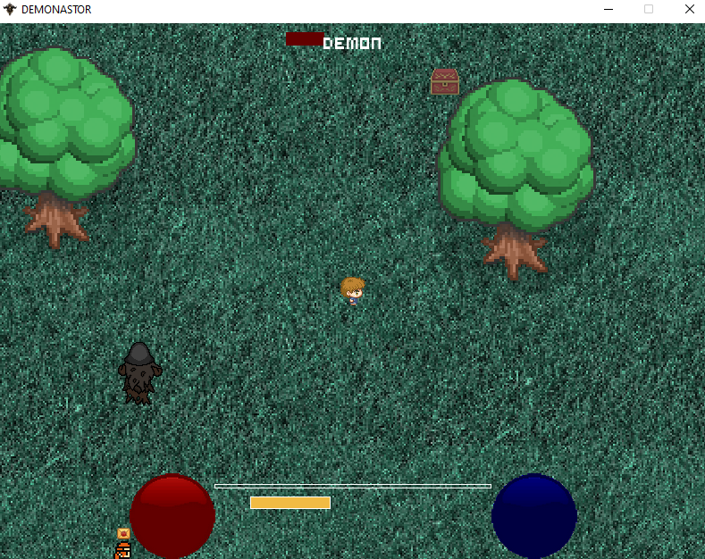

# Demonastor

## Description
Course project on programming, a simple game in the spirit of Diablo
## Features
Implemented:
* moving the character (the sprites also turn in the right direction)
* attacking with two magic spells
* primitive behavior of NPCs and enemies (they chase you until they kill you)
* opening chests with sound playing
* picking up things and adding them to the inventory (though , they can't be used)
* quick save / load (should work)
## Control
* WASD - moving
* Space - attack
* C - change weapon
* I - inventory
* ESC - pause menu
* F5 - quick save
* F9 - quick load
